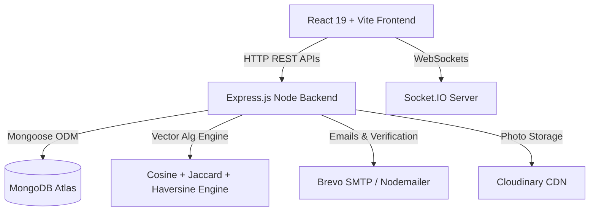
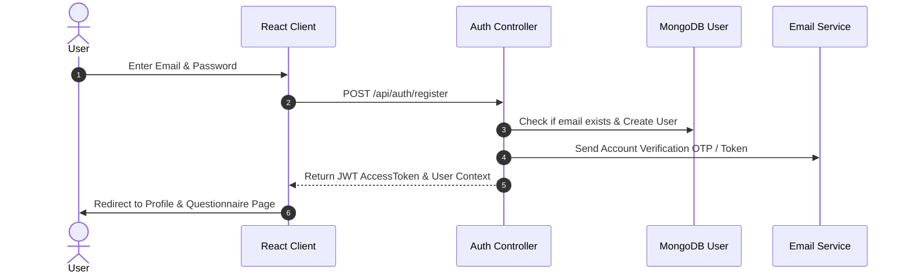
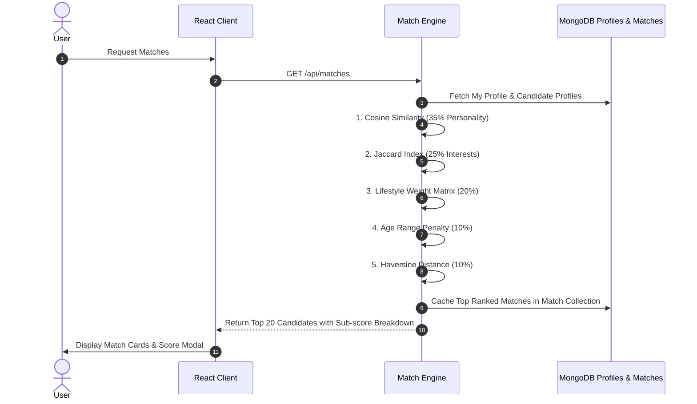
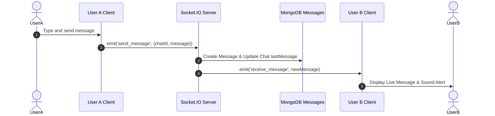

# SoulSync Architecture & Sequence Diagrams

---

## 1. System Context Architecture

---

## 2. Authentication Sequence Diagram

---

## 3. 5D Compatibility Matching Sequence Diagram

---

## 4. Socket.IO Real-Time Chat Sequence Diagram

